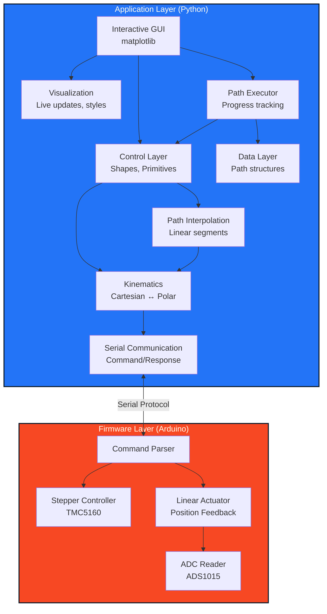

# Architecture

## System Overview

The pen plotter control system uses a layered architecture separating firmware (Arduino - low-level hardware control) from application code (Python CLI - high-level path planning and user interface).



## Serial Protocol

### Command Format

```
COMMAND [arg1] [arg2] ...\n
```

### Response Format

```
OK [data]\n
ERROR: [message]\n
```

### Commands

| Command           | Parameters         | Description                                | Response                 |
| ----------------- | ------------------ | ------------------------------------------ | ------------------------ |
| `HOME`            | None               | Move to home/zero position (drawing start) | `OK`                     |
| `ROTATE <steps>`  | steps (int)        | Rotate to absolute position (microsteps)   | `OK`                     |
| `LINEAR <target>` | target (ADC value) | Move to target extension using feedback    | `OK`                     |
| `STOP`            | None               | Emergency stop all motors                  | `OK`                     |
| `GET_POS`         | None               | Get current position                       | `OK <steps> <adc_value>` |
| `STATUS`          | None               | Get system status                          | Status info              |

**Notes:**

- All movements are position-based (not speed-based)
- Firmware waits for `position_reached()` before responding `OK`
- `LINEAR` uses ADC feedback control to reach target position
- Zero position (HOME) is the drawing start point - pen always down

## Coordinate Systems

### Firmware (Polar)

- **Rotation**: Microsteps (0 to 1,024,000 per revolution)
- **Extension**: ADC value (0 to max) or PWM-based position

### Application (Cartesian)

- **Position**: (x, y) in mm or arbitrary units
- **Origin**: Center of rotation

### Transformation

```python
# Cartesian to Polar
r = sqrt(x^2 + y^2)
θ = atan2(y, x)
steps = (θ / 360) * 1024000

# Polar to Cartesian
x = r * cos(θ)
y = r * sin(θ)
```

## Module Responsibilities

### Firmware (firmware/pen_plotter/)

- Parse serial commands
- Execute motor movements
- Report position and status
- Enforce hardware limits
- **Does not**: Understand shapes, paths, or high-level geometry

### Python Hardware Layer (penplotter/hardware/)

- Serial port management
- Command transmission
- Response parsing
- Connection state handling

### Python Kinematics Layer (penplotter/kinematics/)

- Coordinate transformations (polar ↔ Cartesian)
- Calibration data management
- Workspace validation
- Line interpolation (if needed)

### Python Control Layer (penplotter/control/)

- Shape drawing functions (rectangles, primitives)
- Drawing primitives (lines with interpolation)
- Point validation and workspace checking
- Path execution coordination

### Python Visualization Layer (penplotter/visualization/)

- Interactive matplotlib-based GUI
- Live actuator arm visualization
- Workspace boundary display
- Drawing path preview
- Connection status indicators
- Click-to-add-point interaction
- Monumental design system colors and styling

### Python Data Layer (penplotter/data/)

- Path data structures
- Path statistics calculation
- Segment management

### Python Path Layer (penplotter/path/)

- Linear path interpolation
- Step size control

**Note:** The system features an interactive matplotlib-based GUI that provides real-time visualization of the pen plotter's state, including live actuator arm position updates during drawing execution.

## Data Flow Example: Drawing a Path

1. User launches GUI: `python -m penplotter` or `./run.sh`
2. User clicks "Detect" to find serial ports and "Connect" to establish connection
3. User clicks on canvas to add path points: [(x1,y1), (x2,y2), (x3,y3), ...]
4. GUI validates each point against workspace boundaries in real-time
5. User clicks "Execute" to start drawing
6. Path Executor processes the path:
   - Interpolates each segment into small steps
   - For each interpolated point:
     - Kinematics converts (x, y) → (θ, r)
     - Serial layer sends `ROTATE <steps>` and waits for `OK`
     - Serial layer sends `LINEAR <target>` and waits for `OK`
     - Executor triggers progress callback
   - GUI updates actuator arm visualization live during drawing
7. Drawing complete, plotter returns to home

## GUI Interaction Model

The system uses an interactive GUI approach rather than configuration files:

**Interactive Drawing:**
- Click on canvas to add path points
- Visual feedback shows workspace boundaries
- Real-time validation of point coordinates
- Live actuator arm visualization during execution
- Progress tracking and statistics display

**Configuration (penplotter/config.py):**
```python
# Hardware calibration parameters
BOARD_WIDTH = 280  # mm
BOARD_HEIGHT = 350  # mm
PEN_OFFSET_MM = 160  # mm from rotation axis to pen home

# Stepper motor configuration
MICROSTEPS_PER_STEP = 256
STEPS_PER_REV = 200
GEARBOX_RATIO = 20

# Linear actuator ADC calibration
LINEAR_ADC_MIN = 1000  # Fully retracted
LINEAR_ADC_MAX = 30000  # Fully extended
LINEAR_ADC_HOME = 5000  # Home/drawing position
```

## Calibration Strategy

### ADC Calibration (Required)

The linear actuator uses potentiometer feedback read via ADS1015 ADC. Calibration maps ADC values to physical positions.

**Calibration Process:**

1. Run calibration routine: `python -m penplotter calibrate`
2. Follow prompts to:
   - Move actuator to fully retracted position → record ADC value (min)
   - Move actuator to fully extended position → record ADC value (max)
   - Move to home/zero position (drawing start) → record ADC value
3. Store values in `calibration.yaml`

**Calibration File Format:**

```yaml
linear:
  adc_min: 1000 # Fully retracted
  adc_max: 30000 # Fully extended
  adc_home: 5000 # Drawing start position (zero)

stepper:
  home_position: 0 # Home position in microsteps
  max_rotation: 1024000 # Full rotation (optional limit)
```

### Runtime Validation

- Check target positions against calibrated limits
- Prevent movements outside workspace
- Warn user if shape exceeds boundaries
- All movements relative to home position

## Error Handling

### Firmware

- Timeout on motor movements
- Invalid command format
- Hardware errors (driver disconnected)

### Python

- Serial connection loss → retry and report
- Invalid coordinates → reject before sending
- Command timeout → retry or abort
- Configuration errors → validate before execution

## Extension Points

### Implemented Features

- **Interactive GUI**: matplotlib-based GUI with click-to-draw interface
- **Live visualization**: Real-time actuator arm position updates during drawing
- **Serial port auto-detection**: Automatic detection of USB serial ports
- **Path validation**: Real-time workspace boundary checking
- **Progress tracking**: Path statistics and execution progress monitoring
- **Monumental design system**: Consistent color scheme and styling

### Future Extensions (If Time Permits)

- **Shape templates**: Pre-defined shapes (rectangles, polygons, circles)
- **Path smoothing**: Bézier curves and spline interpolation
- **Undo/Redo history**: Full path editing capabilities
- **Path export/import**: Save and load drawing paths
- **Multi-layer drawings**: Support for complex multi-path compositions

## Design Decisions

### Why separate coordinate systems?

- Firmware deals with hardware reality (microsteps, ADC values)
- Application deals with user intent (shapes, coordinates)
- Clean separation allows firmware to be simple and reliable

### Why command-based protocol?

- Firmware stays simple (no complex logic)
- Easy to test and debug
- Flexible for future extensions
- Application handles all intelligence

### Why matplotlib GUI for application?

- Fast development for 2-day timeline
- Rich Python libraries (matplotlib, numpy, pyserial)
- Interactive visualization with minimal setup
- Direct serial port access
- Built-in event handling for clicks and buttons
- Real-time plotting capabilities for live actuator visualization
- Professional appearance with custom styling
- Avoids complexity of web stack (backend server, React frontend)
- Matplotlib provides both visualization and GUI controls in one framework
- Appropriate scope for 2-day assignment

## Design Decisions

### Linear Actuator Control

**Decision:** Position-based feedback control using ADC readings

- Firmware moves to target ADC value and waits for position reached
- More accurate than open-loop speed control
- Better for precise shape drawing
- Speed control may be added later for curve optimization

### Firmware Blocking

**Decision:** Firmware waits for `position_reached()` before responding `OK`

- Python application knows when movement is complete
- Simpler synchronization
- Prevents command queue issues

### Curves

**Decision:** Defer to later (Day 2 if time permits)

- Focus on rectangle/polygon first (Day 1 requirement)
- May require interpolation and speed optimization
