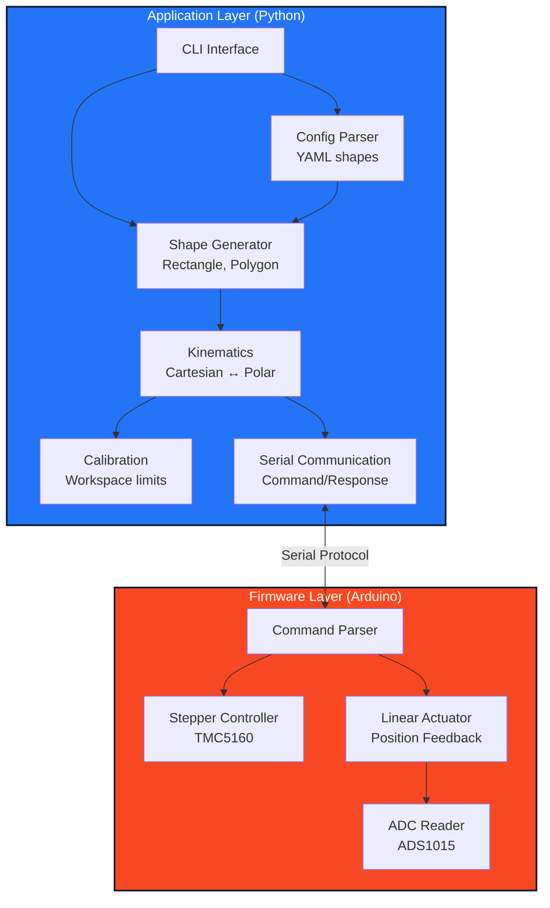

# Architecture

## System Overview

The pen plotter control system uses a layered architecture separating firmware (Arduino - low-level hardware control) from application code (Python CLI - high-level path planning and user interface).



## Serial Protocol

### Command Format

```
COMMAND [arg1] [arg2] ...\n
```

### Response Format

```
OK [data]\n
ERROR: [message]\n
```

### Commands

| Command           | Parameters         | Description                                | Response                 |
| ----------------- | ------------------ | ------------------------------------------ | ------------------------ |
| `HOME`            | None               | Move to home/zero position (drawing start) | `OK`                     |
| `ROTATE <steps>`  | steps (int)        | Rotate to absolute position (microsteps)   | `OK`                     |
| `LINEAR <target>` | target (ADC value) | Move to target extension using feedback    | `OK`                     |
| `STOP`            | None               | Emergency stop all motors                  | `OK`                     |
| `GET_POS`         | None               | Get current position                       | `OK <steps> <adc_value>` |
| `STATUS`          | None               | Get system status                          | Status info              |

**Notes:**

- All movements are position-based (not speed-based)
- Firmware waits for `position_reached()` before responding `OK`
- `LINEAR` uses ADC feedback control to reach target position
- Zero position (HOME) is the drawing start point - pen always down

## Coordinate Systems

### Firmware (Polar)

- **Rotation**: Microsteps (0 to 1,024,000 per revolution)
- **Extension**: ADC value (0 to max) or PWM-based position

### Application (Cartesian)

- **Position**: (x, y) in mm or arbitrary units
- **Origin**: Center of rotation

### Transformation

```python
# Cartesian to Polar
r = sqrt(x^2 + y^2)
θ = atan2(y, x)
steps = (θ / 360) * 1024000

# Polar to Cartesian
x = r * cos(θ)
y = r * sin(θ)
```

## Module Responsibilities

### Firmware (firmware/pen_plotter/)

- Parse serial commands
- Execute motor movements
- Report position and status
- Enforce hardware limits
- **Does not**: Understand shapes, paths, or high-level geometry

### Python Hardware Layer (penplotter/hardware/)

- Serial port management
- Command transmission
- Response parsing
- Connection state handling

### Python Kinematics Layer (penplotter/kinematics/)

- Coordinate transformations (polar ↔ Cartesian)
- Calibration data management
- Workspace validation
- Line interpolation (if needed)

### Python Shapes Layer (penplotter/shapes/)

- Rectangle generation
- Polygon generation (N sides)
- Curve generation (Bézier, arcs)
- Config file parsing (YAML)

### Python UI Layer (penplotter/ui/)

- CLI argument parsing (argparse)
- Command dispatch
- Progress display and status updates
- Interactive mode for testing
- Color output and formatting
- Error reporting and user feedback

**Note:** UI is a Python CLI application (not web-based). Enhanced UX features include progress indicators, color output, and interactive testing mode - appropriate for the 2-day timeline.

## Data Flow Example: Drawing a Rectangle

1. User: `python -m penplotter draw-rectangle --size 50 --rotation 45`
2. CLI parses arguments
3. Rectangle generator creates corners: [(x1,y1), (x2,y2), (x3,y3), (x4,y4)]
4. For each corner:
   - Kinematics converts (x, y) → (θ, r)
   - Serial layer sends `ROTATE <steps>` and waits for `OK`
   - Serial layer sends `LINEAR <target>` and waits for `OK`
5. Drawing complete

## Configuration Format

```yaml
shape:
  type: rectangle | polygon | curve

  # Rectangle
  width: 50
  height: 30
  rotation: 45
  center: [0, 0]

  # Polygon
  sides: 6
  radius: 40
  rotation: 0
  center: [0, 0]

  # Curve (future extension)
  type: bezier
  control_points: [[x1,y1], [x2,y2], ...]
```

## Calibration Strategy

### ADC Calibration (Required)

The linear actuator uses potentiometer feedback read via ADS1015 ADC. Calibration maps ADC values to physical positions.

**Calibration Process:**

1. Run calibration routine: `python -m penplotter calibrate`
2. Follow prompts to:
   - Move actuator to fully retracted position → record ADC value (min)
   - Move actuator to fully extended position → record ADC value (max)
   - Move to home/zero position (drawing start) → record ADC value
3. Store values in `calibration.yaml`

**Calibration File Format:**

```yaml
linear:
  adc_min: 1000 # Fully retracted
  adc_max: 30000 # Fully extended
  adc_home: 5000 # Drawing start position (zero)

stepper:
  home_position: 0 # Home position in microsteps
  max_rotation: 1024000 # Full rotation (optional limit)
```

### Runtime Validation

- Check target positions against calibrated limits
- Prevent movements outside workspace
- Warn user if shape exceeds boundaries
- All movements relative to home position

## Error Handling

### Firmware

- Timeout on motor movements
- Invalid command format
- Hardware errors (driver disconnected)

### Python

- Serial connection loss → retry and report
- Invalid coordinates → reject before sending
- Command timeout → retry or abort
- Configuration errors → validate before execution

## Extension Points

### Day 2 Creative Extensions (Planned Focus)

- **Config file support**: Add YAML parser and shape factory for polygons
- **Enhanced CLI**: Interactive testing mode, progress indicators, color output
- **Polygon support**: N-sided regular polygons with configurable parameters
- **Better calibration**: Guided calibration routine with clear prompts

### Future Extensions (If Time Permits)

- **Curve support**: Bézier curves with interpolation and speed control
- **Web UI**: React frontend with WebSocket backend (would require significant additional time)

## Design Decisions

### Why separate coordinate systems?

- Firmware deals with hardware reality (microsteps, ADC values)
- Application deals with user intent (shapes, coordinates)
- Clean separation allows firmware to be simple and reliable

### Why command-based protocol?

- Firmware stays simple (no complex logic)
- Easy to test and debug
- Flexible for future extensions
- Application handles all intelligence

### Why Python CLI for application?

- Fast development for 2-day timeline
- Rich libraries (numpy, yaml, pyserial)
- Easy to parse config files
- Direct serial port access
- CLI tools are practical and professional
- Can add enhanced UX features (progress bars, colors, interactive mode)
- Avoids complexity of web stack (backend server, React frontend)
- Appropriate scope for 2-day assignment

## Design Decisions

### Linear Actuator Control

**Decision:** Position-based feedback control using ADC readings

- Firmware moves to target ADC value and waits for position reached
- More accurate than open-loop speed control
- Better for precise shape drawing
- Speed control may be added later for curve optimization

### Firmware Blocking

**Decision:** Firmware waits for `position_reached()` before responding `OK`

- Python application knows when movement is complete
- Simpler synchronization
- Prevents command queue issues

### Curves

**Decision:** Defer to later (Day 2 if time permits)

- Focus on rectangle/polygon first (Day 1 requirement)
- May require interpolation and speed optimization
